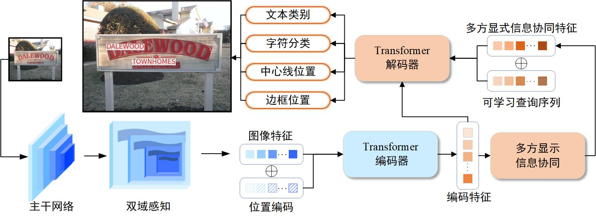

<h1 align="center"> MSIDA </h1> 

  <a href="#介绍">介绍</a> |
  <a href="#模型性能">模型性能</a> |
  <a href="#环境">环境</a> |
  <a href="#数据集">数据集</a> |

## 介绍

**摘要：** 在复杂自然场景的端到端文本识别中，由于文本和背景难以区分，文本检测的位置信息和识别的语义信息不匹配，无法有效利用检测和识别之间的相关性。针对该问题，该文提出双域感知下多方显式信息协同的自然场景端到端文本识别方法(Multi-party Synergetic Information with Dual-domain Awareness Text Spotting, MSIDA)，通过强化文本区域特征和边缘纹理，利用文本检测和识别特征之间的协同作用提高端到端文本识别性能。首先，设计融合文本空间和方向信息的双域感知模块，增强文本实例的视觉特征信息；其次，提出多方显式信息协同模块提取编码特征中的显式信息，通过匹配对齐用于检测和识别的位置、分类和字符多方信息生成候选文本实例；最后，协同特征通过解码器引导可学习的查询序列获得文本检测和识别的结果。

## 模型性能

|Benchmark|Backbone|Detection|F-measure|
|:------:|:------:|:------:|:------:|
|Total-Text|ResNet-50|87.7|80.5|
|ICDAR15|ResNet-50|90.3|87.6|
|CTW1500|ResNet-50|89.5|64.6|

## 环境

Python 3.8 + PyTorch 1.9.0 + CUDA 11.1

## 数据集

>**Total-Text:**  https://github.com/cs-chan/Total-Text-Dataset  
>
>**ICDAR2015**: https://iapr.org/archives/icdar2015/index.html  
>
>**CTW1500**: https://github.com/Yuliang-Liu/Curve-Text-Detector  
